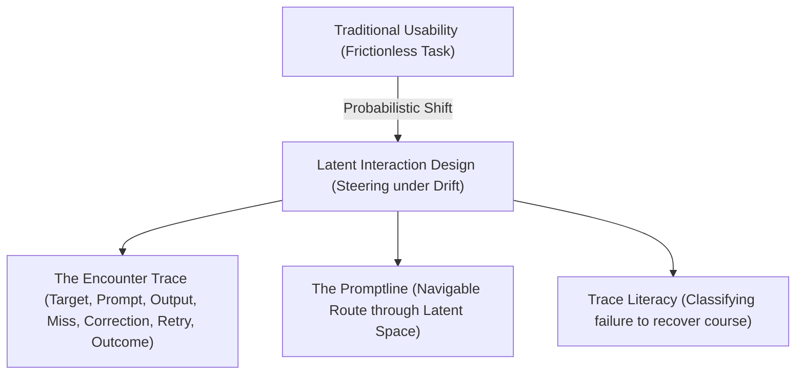

# Chapter 2: Latent Interaction Design
## Steering, Trace Literacy, and the Limits of Usability

> **Author**: Watson Hartsoe
> **Lineage Source**: `latent-interaction-genome.yaml`
> **Status**: Operative Draft

---

### §2.1 The Post-Usability Threshold

Traditional Human-Computer Interaction (HCI) is haunted by the **Occult Fallacy**—the assumption that interfaces are stable windows into deterministic backends. Under the optimization regime of cognitive engineering, usability was measured through time-on-task, error rates, and subjective satisfaction scores.

This project asks whether these metrics hold when interacting with generative media. An LLM is not a deterministic tool; it behaves as a **probabilistic response surface**. It does not possess a fixed set of buttons or navigation routes. To interact with it is to navigate a latent ocean, where the prompt acts as a rudder under conditions of continuous drift.

Therefore, we propose **Latent Interaction Design (LID)** as a hypothesis to test whether tracing the encounter trace provides a more repeatable and rigorous framework than standard task-usability metrics.



The basic unit of analysis for LID is the **encounter trace**: a timed sequence of target specifications, prompt drafts, model outputs, classified misses, correction moves, retries, branch rollbacks, and final outcomes. Correctness is no longer proven by a single, clean output, but by the durability and recoverability of the route.

---

### §2.2 The Academic Jukebox: A Genealogy of Steering

Latent Interaction Design does not emerge from nowhere. It is the synthesis of seven historical epochs of control, context, and embodiment:

| Epoch | Paradigm | Primary Question | Key Abstraction | Method |
| :--- | :--- | :--- | :--- | :--- |
| **1940s–60s** | Cybernetic Formation | How does a system steer through feedback? | Feedback loop, variety, homeostat | System modeling, adaptive regulation |
| **1970s–80s** | Cognitive Engineering | How efficiently can a user complete a task? | Task model, error rate, time-on-task | Lab study, GOMS modeling |
| **1980s–90s** | Situated Turn | Why do plans fail in real settings? | Situated action, breakdown, coordination | Ethnography, conversation analysis |
| **1990s–00s** | Embodied Interaction | How does action couple with physical tools? | Ready-to-hand, coupling, rhythm | Prototyping, phenomenological audit |
| **2000s–10s** | Third-Wave Expansion | What cultural knowledge do artifacts produce? | Speculative object, ambiguity, experience | Research through Design, design fiction |
| **2010s–20s** | Algorithmic Mediation | How do humans negotiate automated bias? | Automation trust, explanation, limits | Auditing, user trust experiments |
| **2022–Pres** | Latent Interaction | How do practitioners steer probabilistic drift? | Promptline, trace, target fidelity | Live trace capture, failure classification |

#### The Inherited Lessons of the Jukebox:
1. **Wiener & Ashby (Cybernetics)**: Interaction is steering under constraint. Control requires variety in the prompt engineering interface equal to the variety of the model's latent states.
2. **Suchman (Situated Action)**: A prompt is not a master plan that executes perfectly; it is a situated action that breaks down immediately upon contact with the model's priors, requiring real-time repair.
3. **Winograd & Flores (Breakdown)**: The interface only becomes visible when it fails. The "miss" in prompting is not an error to be hidden behind a polished wrapper; it is the diagnostic material that reveals the model's boundaries.
4. **Dourish (Embodied Interaction)**: Embodiment is not just bodily presence; it is the rhythm of iteration, the physical strain of repetitive retries, and the cognitive fatigue of correcting model drift.
5. **Geertz (Thick Description)**: To prompt effectively is to engineer context. A prompt is a "thick description" that specifies not only the target token, but the active constraint field surrounding it.

#### §2.2.5 Lineage Pressures: Geertz and Suchman

Rather than citing these thinkers to validate our method, we use their concepts to pressure the limits of Latent Interaction Design.

##### Clifford Geertz: The Limits of Thick Prompting
*   **The Question:** Is thick prompting a repeatable method, or just an individual writing style?
*   **The Pressure:** Geertz’s *Interpretation of Cultures* defines thick description as an ethnographic practice of parsing complex social actions (e.g. distinguishing a twitch from a wink). When we apply this to prompting, we package cultural density into keyword stacks for a machine. But a neural network has no culture; it has only high-dimensional token counts.
*   **The Critical Boundary:** If a second researcher cannot use the 6-layer rubric (World-state, Cultural frame, etc.) to recreate the same aesthetic constraints, then "thick prompting" is not a method—it is merely a personal aesthetic style.

##### Lucy Suchman: The Illusion of the Plan
*   **The Question:** How do prompt-output-revision loops repair failed descriptions?
*   **The Pressure:** Suchman’s *Plans and Situated Actions* warns that cognitive plans do not determine actions; instead, actions are situated in response to real-time environments. If we treat a prompt as a "world-compiler," we fall into the plan fallacy.
*   **The Critical Boundary:** The prompt-output-revision loop is not a structured pipeline; it is an ad-hoc, situated negotiation. The loop is only "real" if we can document that the next prompt ($A'$) was shaped by the specific failure or breakdown ($R$) of the previous output ($C$), rather than a pre-planned sequence.

---

### §2.3 Distant Writing and the Generative Gap

In analyzing the production of interactive generative works, we draw a bridge between Luciano Floridi's concept of **"distant writing"** and Jenny Lindhe's **"digital ekphrasis"**. Neither scholar cites the other, yet they define the same operational coordinate:

*   **Distant Writing**: The meta-author acts as an architect. They do not write the sentences; they write the constraints (prompts) that govern the machine's generative trajectory. Creative control is decoupled from execution.
*   **Digital Ekphrasis**: The performer uses verbal descriptions to activate visual, interactive, or physical responses in digital interfaces. The text acts as a cybernetic governor.

This decoupling introduces the **generation gap**—the distance between human design intent and probabilistic execution. The prompt engineer does not discover a pre-existing output; they steer through a series of "misses" to retrieve it.

---

### §2.4 Case Study: The "Ripples" DJ-Deck

The *Ripples* project is a concrete realization of Latent Interaction Design. The experiment began with a **worldtext**—a master system prompt designed to build a multi-paned web interface resembling a DJ's mixing console.

```
       [ MASTER SYSTEM PROMPT: WORLDTEXT ]
                       │
         ┌─────────────┼─────────────┐
         ▼             ▼             ▼
    [ Artist A ]  [ Artist B ]  [ Artist C ]
    (Aesthetic 1) (Aesthetic 2) (Aesthetic 3)
         │             │             │
         └─────────────┼─────────────┘
                       ▼
           [ Three Rippling Decks ]
```

#### The Architecture of the Deck
The DJ deck functions as an analogical control surface:
1. **Panels**: Distinct viewport panes displaying human, nonhuman, or posthuman narrative agents.
2. **Levers (Controls)**: Sliders and dials that adjust the "relational tension," "drift rate," or "attractor scale" between these agents.
3. **The Play Surface**: A dynamic canvas where text, visual fragments, and code respond to manual parameter shifts.

#### The Prompting Process and Divergence
Three practitioners took this identical worldtext and steered it in highly divergent aesthetic directions:
*   **Decay and Corrosion**: Steering the deck toward noise, using prompt variables to inject corruption and simulate linguistic wear over time.
*   **Cybernetic Ecology**: Shaping the relationship between human diaries and sensor logs, mapping physical inputs directly to typographic weight.
*   **Specular Fiction**: Elevating the "nonhuman" panel to dominate the screen, forcing the human agent's text to shrink to unreadable scales based on state changes.

#### Breakdowns and the Craft Object
The *Ripples* experiment is used to test whether LLM outputs drift toward generic defaults when prompted without strict constraints. We ask: Does obtaining aesthetic intent require a documented battle against this gravity?

The primary question is whether the critical artifact of the project is the final three HTML pages or the **log of the encounter**—the record of prompt adjustments, configuration rollbacks, and shared notes. If tracing this encounter trace does not reveal a measurable difference in subsequent steering decisions, the LID framework is redundant.

---

### §2.5 The Instrument Panel (Harnessing the Surface)

To move beyond the "best prompt" fetish, Latent Interaction Design requires a suite of operational instruments:

1. **Trace Recorder**: A local logger that captures prompt, raw output, retry variations, and model state parameters.
2. **Failure Classifier**: A diagnostic tool to label misses (e.g., *style prior capture*, *context collapse*, *guardrail distortion*).
3. **Variation Grid**: A testing surface that runs parallel completions under varying temperatures to map the stability of a promptline.
4. **Correction Pressure Meter**: An interface element that monitors operator pauses, rollback moves, and edit frequency to quantify interaction strain.

By shifting HCI's focus from the polished wrapper to the instrumented trace, we transform prompt engineering from a folk art into an auditable, rigorous, and expressive craft.

---

### §2.6 Abstracts: Coaxing the Ripples
Below are three distinct abstract proposals for the *Ripples* research paper, tailored to target different scholarly venues.

#### Option A: The Critical Digital Humanities (DH) & Philosophy Focus
*Target: Electronic Literature Organization (ELO) or Digital Humanities Quarterly (DHQ)*

```text
Coaxing the Ripples: Distant Writing and the Genealogy of Generative Ekphrasis

Abstract:
This paper reflects on the genealogy of "Ripples," an experiment in what Luciano Floridi calls "distant writing"—a practice where the human author designs metaprompts to generate interactive, multimodal artifacts. Beginning with a single "worldtext" master prompt, three practitioners generated three highly divergent, multi-paned "DJ decks" that perform relationships between human and nonhuman entities. By mapping this process onto Jenny Lindhe's concept of "digital ekphrasis," we analyze the creative tension that arises in the generation gap between verbal design intent and probabilistic execution. We document the shared experience of coaxing aesthetic intent out of LLMs over several months, detailing the cycle of evocative machine response, the struggle against the sterile gravity of default model language, and the recovery of creative agency through the formalization of the "encounter trace."
```

#### Option B: The Practice-Based & Research-through-Design (RtD) Focus
*Target: ACM Designing Interactive Systems (DIS) or Creativity & Cognition (C&C)*

```text
Coaxing the Ripples: Research through Design in the Metaprompting of Interactive Surfaces

Abstract:
We present "Ripples," a practice-based inquiry into the design of interactive narrative systems via multilayered metaprompting. Using a shared "worldtext" prompt as a generative substrate, we co-designed a multi-paned dashboard that figures the user as a performer steering human-nonhuman narrative relations. We document how three distinct aesthetic directions were negotiated through iterative prompt-completion cycles. Through a Research through Design (RtD) lens, we analyze the breakdown moments, the mechanical fatigue of prompt-debugging, and the ways in which model drift acts as a material constraint. We argue that the critical artifact in generative design is not the completed screen, but the documented "promptline"—the navigable path through the model's response surface.
```

#### Option C: The Post-Usability HCI Theory Focus
*Target: ACM Conference on Human Factors in Computing Systems (CHI) - Short Paper / Case Study*

```text
Coaxing the Ripples: Beyond Usability in Generative Interaction Design

Abstract:
Traditional usability metrics—such as time-on-task and error reduction—fail when applied to generative AI interaction because probabilistic models behave as fluid response surfaces rather than stable tools. This case study details "Ripples," a collaborative design project in which a single system prompt was coaxed into three distinct interactive web-based narrative consoles. We utilize this experiment to formulate "Latent Interaction Design" (LID), a post-usability framework that shifts the unit of analysis from the interface screen to the "encounter trace" (the history of prompts, outputs, misses, and corrections). We analyze the live correction sequences, the resistance of model-trained linguistic biases, and the design patterns necessary for steering systems under drift.
```
