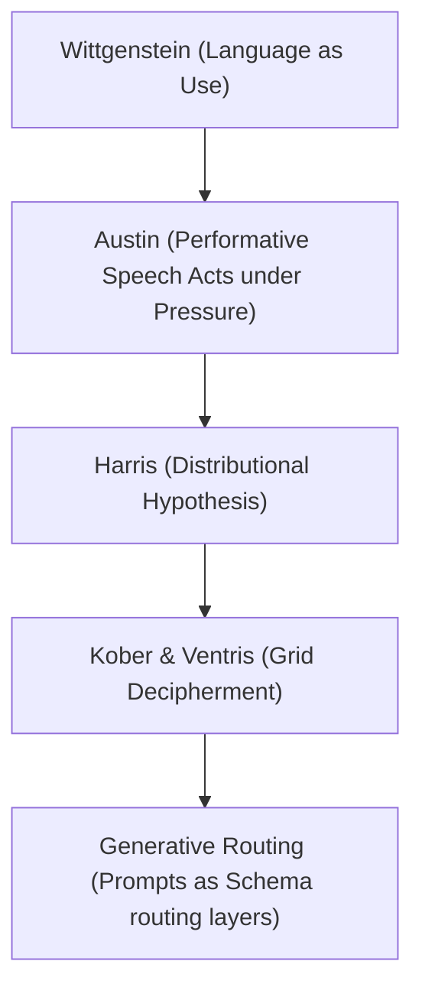

# Chapter 3: Executable Semantics After Wittgenstein
## Decipherment, Embodied Cognition, and Cyber-Physical Action

> **Author**: Watson Hartsoe
> **Status**: Operative Draft
> **Lineage**: Academic Jukebox for Executable Semantics

---

### §3.1 The Academic Jukebox: A Lineage of Executable Semantics

In the classical view, language is a mirror representing a pre-existing reality. This chapter tests the hypothesis that in generative architectures, natural language behaves not as a mirror, but as a **routing layer**—shifting vector coordinates to select tools, instantiate states, and redirect system actions. Rather than asserting the speculative claim that language "becomes executable code" or "acts as a compiler," we narrow the inquiry: Under what conditions does natural language successfully route action within application-defined schemas?

To understand this shift, we build the "academic jukebox"—a genealogy of thinkers who decoupled language from static representation and paved the way for executable semantics:



| Source | Core Theoretical Abstraction | Efficacy for Worldtext & Prompting |
| :--- | :--- | :--- |
| **Ludwig Wittgenstein** | Language-games; meaning as use in the stream of life. | Prompts have no static definitions; their meaning is the output distribution they actuate. |
| **Ferdinand de Saussure** | Structural linguistics; relational value of signs. | Latent space as a purely relational network where value is determined by difference. |
| **Zellig Harris** | Distributional Structure; context-dependent token distributions. | The mathematical foundation of embedding models: word meaning is vector coordinate. |
| **J. L. Austin** | Performative utterances; speech act performativity. | Prompts are performatives whose force is constrained by application schemas. |
| **Alice Kober** | Systemic decipherment; relational grids of unknown glyphs. | Relational vector spaces preceding semantic representation. |
| **Michael Ventris** | Decipherment of Linear B via structural grid mapping. | Structural correspondence as translation layer rather than understanding. |
| **Joseph Weizenbaum** | ELIZA; syntactic substitution as illusion of understanding. | Syntactic feedback mimicking semantic depth. |
| **John Searle** | The Chinese Room; symbol manipulation vs. intentionality. | The generative gap: navigating the vector grid without intentional reference. |

---

### §3.2 The Decipherment Paradigm: Kober's Grid and Latent Relationality

The decipherment of Linear B by Alice Kober and Michael Ventris provides a precursor to modern embedding models. Before Linear B could be read phonetically, it had to be decoded structurally.

Alice Kober did not guess at sound values. She built a **relational grid**—a matrix where signs sharing a consonant occupied the same column, and signs sharing a vowel occupied the same row. This grid mapped coordinates in a linguistic state-space before assigning sound or meaning.

We use Kober's grid to pressure the core semantic claims of prompting:
*   **The Question:** If a model's embedding space (like CLIP) operates as a relational grid of similarities, does the prompt engineer "write" meaning or merely navigate coordinates?
*   **The Pressure:** John Searle's *Chinese Room* argument shows that symbol manipulation does not equal intentionality. Modern Contrastive Language-Image Pre-training (CLIP) maximizes similarity along a diagonal matrix without "knowing" the entities it relates.
*   **The Critical Boundary:** If changing a description does not shift the coordinates in the latent grid in a way that alters generation ($\Delta G = 0$), the description is not operative. The semantic richness of the prompt is irrelevant if it does not navigate the relational grid.

```
                  [ Alice Kober's Grid ]
             Consonant 1   Consonant 2   Consonant 3
  Vowel 1       Glyph A       Glyph B       Glyph C
  Vowel 2       Glyph D       Glyph E       Glyph F
```

This grid was not semantic; it was relational. It mapped coordinates in a linguistic state-space before assigning sound or meaning. When Michael Ventris finally cracked the script, he did so by matching this relational grid to the geographical place-names of Crete. 

Modern Contrastive Language-Image Pre-training (CLIP) operates on the same decipherment logic. CLIP projects image features and text tokens into a shared high-dimensional vector space. The grid is constructed by maximizing the cosine similarity (the dot product) between correct image-text pairs along the diagonal of a matrix, while minimizing it for incorrect pairs. 

```
               [ CLIP Shared Embedding Space ]
              Image (Bird)   Image (Glass)   Image (Horse)
  Text (Bird)     1.0             0.1             0.0
  Text (Glass)    0.1             1.0             0.1
  Text (Horse)    0.0             0.1             1.0
```

Like Kober's grid, CLIP is a relational machine. Meaning is not a property of the token itself, but a coordinate position relative to all other tokens. The prompt engineer, in writing prompts, is not writing descriptive prose; they are navigating Kober's grid, injecting tokens to shift coordinates in latent space.

---

### §3.3 Austin and the Illocutionary Force of Prompts (Under Pressure)

In *How to Do Things with Words*, J. L. Austin distinguished between **constative** utterances (which describe state) and **performative** utterances (which perform the action they name). Performative language does not report; it acts.

But applying speech-act theory to prompting requires pressure:
*   **The Question:** What kind of doing happens when a prompt produces media rather than an immediate social act?
*   **The Pressure:** Prompts are not sovereign performative speech acts. They do not instantly alter social institutions or guarantee illocutionary success; they are hostage to the model's priors, safety filters, and the platform's execution queues. An LLM cannot make a promise or marry a couple; it only mimics the locutionary surface.
*   **The Critical Boundary:** The prompt's performative force is only active within the limits of the system schema. It does not "compile" a world; it acts as a routing valve. Under this framework, prompting is not a sovereign speech act but a highly constrained steering signal.

In our diagnostic audits of generative systems, we identify three thresholds of performative language:

1. **Locutionary (The text itself)**: The prompt string as written (e.g., `"CLR 0 \n PNT 10 10 20 20 7"`).
2. **Illocutionary (The act of steering)**: The injection of constraints that force the latent model out of its default statistical priors.
3. **Perlocutionary (The consequence)**: The physical rasterization of pixels, the generation of a GIF, or the execution of a cyber-physical command.

Under this framework, prompting is not a passive search query. It is a speech act that executes a world.

---

### §3.4 Cyber-Physical Action and Bounded Routing

Beyond the screen, we test whether language can steer physical systems—what we term **cyber-physical action**. In these systems:
*   The linguistic token is mapped to physical joint rotations or API call vectors defined by application-provided schemas.
*   The prompt is hypothesized to operate as a routing layer, guiding the feedback loop under physical constraints (friction, collision).

This transition bounds the claim of executable semantics:
*   **OpenAI's tool-calling specification** confirms that models do not "compile natural language into execution." Rather, they match natural language instructions to structured JSON schemas provided by the application.
*   The model does not possess a semantic understanding of the physical glass; it matches text inputs to tool definitions.
*   Therefore, the loop is validated not by a magical performative force in natural language, but by whether the system successfully executes the application's underlying code based on the routed token. The loop of language, simulation, feedback, and action is closed under the strict boundaries of the routing schema.
