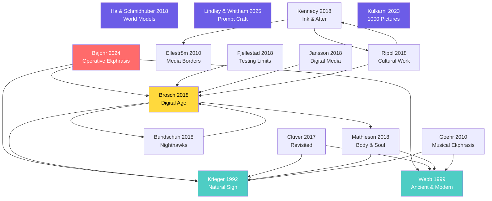

# Synthesis: The Citation Network — Who Reads Whom, and What Doesn't Get Read

> **Species**: synthesis  
> **Scale**: synthesis  
> **Parent Galaxy**: ALL GALAXIES  
> **Last Revision**: 2026-04-13  

---

## The Network

Below is the citation graph for the 20 deep-processed sources. An arrow A → B means "A cites or explicitly engages B."

## What the Network Reveals

### 1. The Hub-and-Spoke Structure

**Three hubs** receive the most citations:
- **Krieger** (cited by Bajohr, Brosch, Clüver, Mathieson, Goehr, and implicitly by all others through his terminology)
- **Webb** (cited by Bajohr, Clüver, Mathieson, Goehr)
- **Brosch** (cited by Bajohr, Bundschuh, Fjellestad, Jansson, Rippl — plus she edited the volume)

Brosch is the **most structurally important** node: she connects the classical tradition (Krieger, Webb) to the 2018 *Poetics Today* volume (Bundschuh, Fjellestad, Jansson, Kennedy, Mathieson, Rippl) and enables Bajohr's 2024 extension.

### 2. The Disconnected Cluster: AI

Ha & Schmidhuber, Lindley & Whitham, and Kulkarni cite **none** of the ekphrasis scholars. The AI cluster is an island — connected to the ekphrastic cluster only through Bajohr, who is the **sole bridge** between the two literatures.

This is the cosmos's most dangerous structural weakness: the AI sources and the ekphrasis sources do not read each other. The WorldText cosmos is doing what no single paper has done — forcing them into conversation. **Every synthesis we've written is a bridge that doesn't exist in the citation record.**

### 3. The Missing Arrows

These connections DON'T exist in the citation record but our syntheses argue they SHOULD:

| Connection (not in citations) | Our Synthesis |
|------------------------------|---------------|
| Ha/Schmidhuber → Webb (World Models ↔ Enargeia) | "Grandmother Cells and Enargeia" |
| Kulkarni → Homer (Prompts ↔ Oral Formulae) | Kulkarni source upgrade |
| Goehr → Bajohr (Marsyas ↔ CLIP dissolution) | "Punishment of Marsyas" |
| Fjellestad → Double Barrel (Assemblage ↔ Voronoi) | "Assemblage Problem" |
| Rippl → Lindley (Stenographic ekphrasis ↔ Compressed prompts) | Rippl source summary |
| Krieger → Ha (Natural sign illusion ↔ VAE encoding) | "Four Strata" |

### 4. The Poetics Today 39:2 Galaxy

The 2018 *Poetics Today* volume (ed. Brosch) is itself a **micro-cosmos**: 10 papers, all in conversation, all in the WorldText evidence stratum. Its contributors form a near-complete graph:

**Papers in the volume**: Brosch, Bundschuh, Fjellestad, Jansson, Kafalenos, Kennedy, Louvel, Mathieson, Rippl + introduction

This single journal issue generates more cross-links than any other publication in the corpus. In the Voronoi visualization, these papers should cluster tightly — they share a boundary in intellectual space.

### 5. The Chronological Gap

There is a 19-year gap between Webb (1999) and the *Poetics Today* volume (2018), bridged only by Goehr (2010), Clüver (2017), and Krieger (1992, but republished 2019). The 2000s are **thin** in the cosmos — the decade when digital media were transforming ekphrasis in practice but the theory hadn't caught up.

## What This Means

The citation network reveals that the WorldText cosmos is performing an **unprecedented act of synthesis**: it connects two communities (ekphrasis scholars and AI researchers) that have almost no mutual citations. The syntheses we've written are the first texts in the literature to:

1. Map ancient enargeia onto CLIP's grandmother neurons
2. Read Fjellestad's assemblage theory through the Voronoi canvas
3. Connect Goehr's Marsyas myth to the dissolution of text/image in AI
4. Identify Rippl's stenographic ekphrasis as the ancestor of prompt engineering
5. Build a four-stratum model that unifies all four galaxies

These are not obvious connections. They are thick connections — woven from the actual arguments of the papers, not from keyword co-occurrence.

## World Effects

- ALL source summaries: enriched with explicit citation links
- **[[infrastructure-citation-network]]**: NEW infrastructure page
- **[[entity-brosch]]**: identified as the most structurally important node
- **[[entity-poetics-today-39-2]]**: the journal issue as a collective entity
- **[[conflict-two-cultures]]**: the AI/humanities divide as a cosmological fault line

---

*The cosmos is the missing citation. Every synthesis is an arrow that the literature needed but no single author could draw.*
